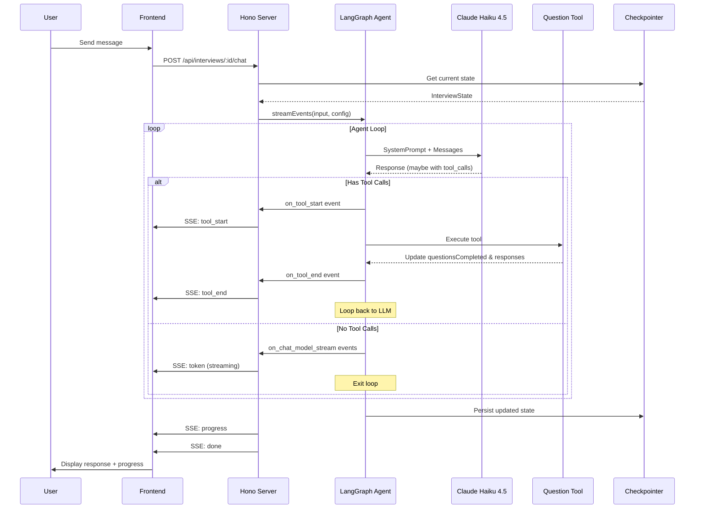

# Agent runtime sequence diagram

```mermaid
sequenceDiagram
    participant U as User
    participant FE as Frontend
    participant API as Hono Server
    participant Agent as LangGraph Agent
    participant LLM as Claude Haiku 4.5
    participant Tool as Question Tool
    participant CP as Checkpointer

    U->>FE: Send message
    FE->>API: POST /api/interviews/:id/chat
    API->>CP: Get current state
    CP-->>API: InterviewState

    API->>Agent: streamEvents(input, config)

    loop Agent Loop
        Agent->>LLM: SystemPrompt + Messages
        LLM-->>Agent: Response (maybe with tool_calls)

        alt Has Tool Calls
            Agent->>API: on_tool_start event
            API->>FE: SSE: tool_start
            Agent->>Tool: Execute tool
            Tool-->>Agent: Update questionsCompleted & responses
            Agent->>API: on_tool_end event
            API->>FE: SSE: tool_end
            Note over Agent: Loop back to LLM
        else No Tool Calls
            Agent->>API: on_chat_model_stream events
            API->>FE: SSE: token (streaming)
            Note over Agent: Exit loop
        end
    end

    Agent->>CP: Persist updated state
    API->>FE: SSE: progress
    API->>FE: SSE: done
    FE->>U: Display response + progress
```
