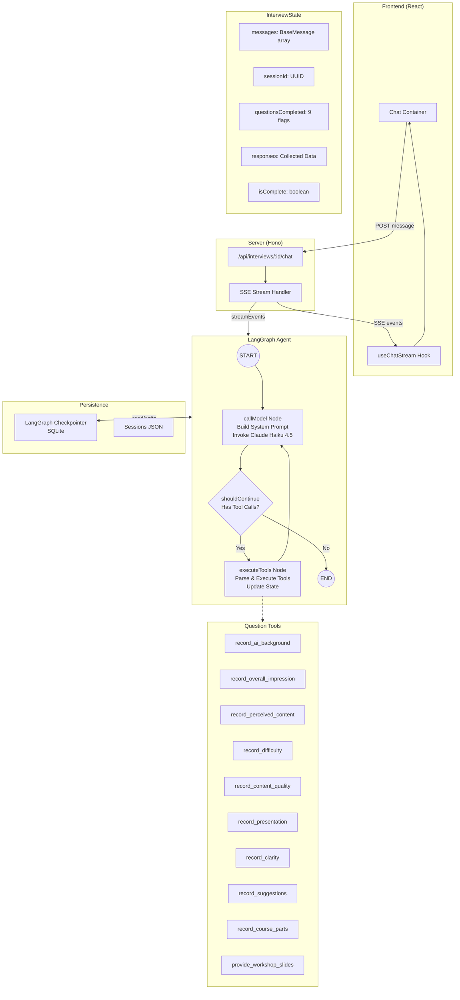

# Application-flowchart

```mermaid
flowchart TB
subgraph Client["Frontend (React)"]
UI[Chat Container]
Stream[useChatStream Hook]
end

    subgraph Server["Server (Hono)"]
        Routes["/api/interviews/:id/chat"]
        SSE[SSE Stream Handler]
    end

    subgraph LangGraph["LangGraph Agent"]
        START((START))
        ModelNode[callModel Node<br/>Build System Prompt<br/>Invoke Claude Haiku 4.5]
        Check{shouldContinue<br/>Has Tool Calls?}
        ToolsNode[executeTools Node<br/>Parse & Execute Tools<br/>Update State]
        ENDNODE((END))

        START --> ModelNode
        ModelNode --> Check
        Check -->|Yes| ToolsNode
        Check -->|No| ENDNODE
        ToolsNode --> ModelNode
    end

    subgraph State["InterviewState"]
        Messages[messages: BaseMessage array]
        SessionId[sessionId: UUID]
        QuestionsCompleted[questionsCompleted: 9 flags]
        Responses[responses: Collected Data]
        IsComplete[isComplete: boolean]
    end

    subgraph Tools["Question Tools"]
        T1[record_ai_background]
        T2[record_overall_impression]
        T3[record_perceived_content]
        T4[record_difficulty]
        T5[record_content_quality]
        T6[record_presentation]
        T7[record_clarity]
        T8[record_suggestions]
        T9[record_course_parts]
        T10[provide_workshop_slides]
    end

    subgraph Persistence["Persistence"]
        Checkpointer[LangGraph Checkpointer<br/>SQLite]
        Sessions[Sessions JSON]
    end

    UI -->|POST message| Routes
    Routes --> SSE
    SSE -->|streamEvents| LangGraph
    LangGraph <-->|read/write| Checkpointer
    ToolsNode -.-> Tools
    SSE -->|SSE events| Stream
    Stream --> UI
```
