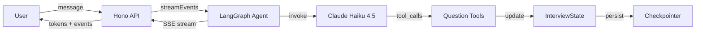

# Dataflow

```mermaid
flowchart LR
    User -->|message| API[Hono API]
    API -->|streamEvents| Agent[LangGraph Agent]
    Agent -->|invoke| LLM[Claude Haiku 4.5]
    LLM -->|tool_calls| Tools[Question Tools]
    Tools -->|update| State[InterviewState]
    State -->|persist| SQLite[Checkpointer]
    Agent -->|SSE stream| API
    API -->|tokens + events| User
```
